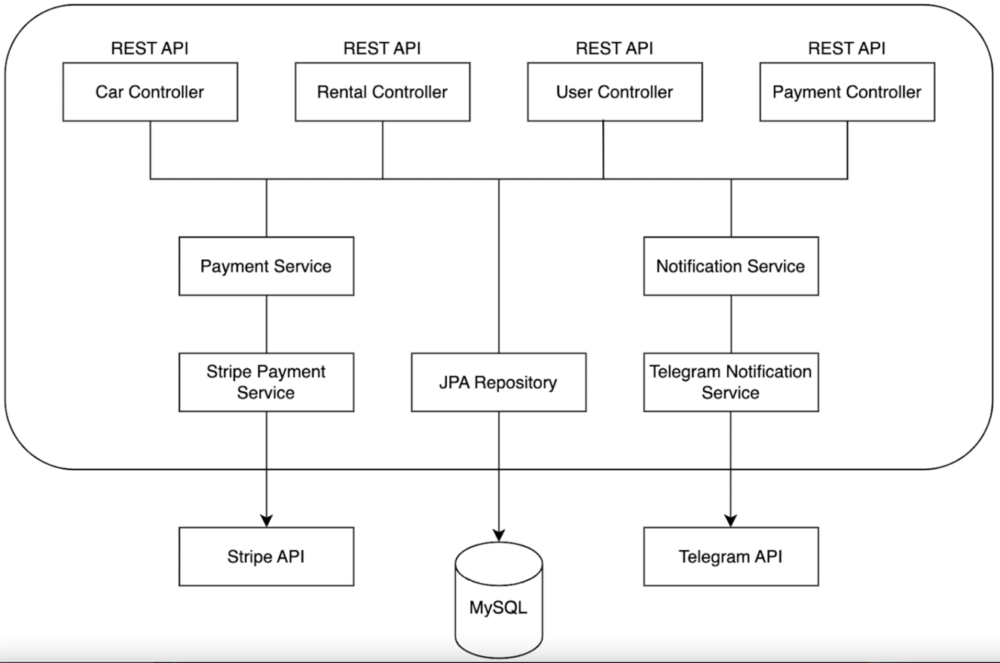

#  Car Sharing App

> Car Sharing App is a Java application based on Spring Boot. This is a system for tracking cars, 
> rentals, users,  and payments in the car sharing service

##  Tech stack

- **Backend:** Spring Framework (Spring Boot, Spring Security, Spring Data JPA)

- **Database:** MySQL

- **ORM:** Hibernate

- **Data mapper:** MapStruct

- **Scheme changes:** Liquibase

- **Containerization:** Docker

- **API Documentation:** Swagger

- **Payment-processing:** StripeAPI

- **Notifications:** TelegramAPI

- **Testing:** JUnit, Mockito, Test Containers

- **Build Tool:** Maven

## Architecture



## Features

### Authentication

🔑 Token-based authentication is implemented in the API. To access you are required to acquire a JSON Web Token (JWT) and include it in the Authorization header.

<details>
  <summary>Registration</summary>

* Endpoint ```/api/auth/registration```
* HTTP Request: POST
* Request Body:
  ``` 
  {
  "email": "string",
  "password": "string",
  "repeatPassword": "string",
  "firstName": "string",
  "lastName": "string"
  }
  ```
* Response: Status Code 200
* Response Body:
  ``` 
  {
  "id": 0,
  "email": "string",
  "firstName": "string",
  "lastName": "string",
  "role": "string"
  }
  ```

</details>

<details>
  <summary>Login</summary>

* Endpoint ```/api/auth/login```
* HTTP Request: POST
* Request Body:
  ``` 
  {
  "email": "string",
  "password": "string"
  }
  ```
* Response: Status Code 200
* Response Body:
  ``` 
  {
  "token": "string"
  }
  ```

</details>

### Users management

<details>
  <summary>Update user by id</summary>

* Endpoint ```/api/users/{userId}/role```
* HTTP Request: PUT
* Response: Status Code 200
* Request Body:
  ```
  {
  "roleName": "MANAGER"
  }
  ```

</details>

<details>
  <summary>User info</summary>

* Endpoint ```/api/users/me```
* HTTP Request: GET
* Response: Status Code 200
* Response Body:
  ```
  {
  "id": 0,
  "email": "string",
  "firstName": "string",
  "lastName": "string",
  "role": "string"
  }
  ```

</details>

<details>
  <summary>Update user info</summary>

* Endpoint ```/api/users/me```
* Request Body:
  ``` 
  {
    "firstName": "string",
    "lastName": "string"
  }
  ```
* HTTP Request: PUT
* Response: Status Code 200
* Response Body:
  ```
  {
    "id": 0,
    "email": "string",
    "firstName": "string",
    "lastName": "string",
    "role": "string"
  }
  ```

</details>


### Cars management

<details>
  <summary>Get car by id</summary>

* Endpoint ```/api/cars/{id}```
* HTTP Request: GET
* Response Body:
  ```
  {
    "id": 0,
    "model": "string",
    "brand": "string",
    "type": "string",
    "inventory": 0,
    "dailyFee": 0
  }
  ```

</details>

<details>
  <summary>Update car by id</summary>

* Endpoint ```/api/cars/{id}```
* HTTP Request: PUT
* Response: Status Code 200
* Response Body:
  ```
  {
    "model": "string",
    "brand": "string",
    "type": "SEDAN",
    "inventory": 0,
    "dailyFee": 0
  }
  ```


</details>

<details>
  <summary>Delete car by id</summary>

* Endpoint ```/api/cars/{id}```
* HTTP Request: DELETE
* Response: Status Code 204


</details>

<details>
  <summary>Get all cars</summary>

* Endpoint ```/api/cars```
* HTTP Request: GET
* Response: Status Code 200
* Response Body:
  ```
  [
    {
      "id": 0,
      "model": "string",
      "brand": "string",
      "type": "string",
      "inventory": 0,
      "dailyFee": 0
    }
  ]
  ```


</details>

<details>
  <summary>Create a new car</summary>

* Endpoint ```/api/cars```
* HTTP Request: POST
* Request Body:
  ```
  {
    "model": "string",
    "brand": "string",
    "type": "SEDAN",
    "inventory": 0,
    "dailyFee": 0
  }
  ```
* Response Body
* Response: Status Code 201
  ```
  {
    "id": 0,
    "model": "string",
    "brand": "string",
    "type": "string",
    "inventory": 0,
    "dailyFee": 0
  }
  ```

</details>

### Payments management

<details>
  <summary>Create payment</summary>

* Endpoint ```/api/payments```
* HTTP Request: POST
* Request Body:
  ```
  {
    "rentalId": 0,
    "paymentType": "PAYMENT"
  }
  ```
* Response Status Code 201
* Response Body:
  ```
  {
    "id": 0,
    "sessionUrl": "string",
    "sessionId": "string",
    "status": "PENDING",
    "type": "PAYMENT",
    "amountToPay": 0,
    "rentalId": 0
  }
  ```

</details>

<details>
  <summary>Get payments</summary>

* Endpoint ```/api/payments```
* HTTP Request: GET
* Response Body:
  ```
  [
    {
      "id": 0,
      "sessionUrl": "string",
      "sessionId": "string",
      "status": "PENDING",
      "type": "PAYMENT",
      "amountToPay": 0,
      "rentalId": 0
    }
  ]
  ```

</details>

<details>
  <summary>Payment success mapping</summary>

* Endpoint ```/api/payments/success```
* HTTP Request: GET
* Response Body:
  ```
  {
    "message": "string"
  }
  ```

</details>

<details>
  <summary>Payment cancel mapping</summary>

* Endpoint ```/api/payments/cancel```
* HTTP Request: GET
* Response Body:
  ```
  {
    "message": "string",
    "sessionUrl": "string"
  }
  ```

</details>

### Rentals management

<details>
  <summary>Create rental</summary>

* Endpoint ```/api/rentals```
* HTTP Request: POST
* Request Body:
  ```
  {
    "carId": 0,
    "returnDate": "2024-05-20"
  }
  ```
* Response Status Code 201
* Response Body:
  ```
  {
    "id": 0,
    "rentalDate": "2024-05-20",
    "returnDate": "2024-05-20",
    "actualReturnDate": "2024-05-20",
    "car": {
      "id": 0,
      "model": "string",
      "brand": "string",
      "type": "string",
      "inventory": 0,
      "dailyFee": 0
    }
  }
  ```

</details>

<details>
  <summary>Get rental by id</summary>

* Endpoint ```/api/rentals/{id}```
* HTTP Request: GET
* Response Body:
  ```
  {
    "id": 0,
    "rentalDate": "2024-05-20",
    "returnDate": "2024-05-20",
    "actualReturnDate": "2024-05-20",
    "car": {
      "id": 0,
      "model": "string",
      "brand": "string",
      "type": "string",
      "inventory": 0,
      "dailyFee": 0
    }
  }
  ```

</details>

<details>
  <summary>Return rental by id</summary>

* Endpoint ```/api/rentals/{id}/return```
* HTTP Request: GET
* Response Body:
  ```
  {
    "id": 0,
    "rentalDate": "2024-05-20",
    "returnDate": "2024-05-20",
    "actualReturnDate": "2024-05-20",
    "car": {
      "id": 0,
      "model": "string",
      "brand": "string",
      "type": "string",
      "inventory": 0,
      "dailyFee": 0
    }
  }
  ```

</details>

<details>
  <summary>Search rentals</summary>

* Endpoint ```/api/payments/cancel```
* HTTP Request: GET
* Request Body:
  ```
  {
    "user_id": "string",
    "is_active": "string"
  }
  ```
* Response Status Code 200
* Response Body:
  ```
  [
    {
      "id": 0,
      "rentalDate": "2024-05-20",
      "returnDate": "2024-05-20",
      "actualReturnDate": "2024-05-20",
      "car": {
        "id": 0,
        "model": "string",
        "brand": "string",
        "type": "string",
        "inventory": 0,
        "dailyFee": 0
      }
    }
  ]
  ```

</details>

##  How to run Book Store API

1) Install Docker
2) Clone current project repository
3) Add your ".env" file (see .env.example)
4) Configure a ".env" file with necessary environment variables 
5) Paste your own {BOT_TOKEN}, {CHAT_ID} and {STRIPE_API_KEY} in .env
6) Run the command ```mvn clean package```
7) Run ```docker-compose up``` to run Docker container
8) Use swagger for testing http://localhost:{SPRING_LOCAL_PORT}/api/swagger
9) Use default link to [Swagger](http://localhost:8081/api/swagger) 
